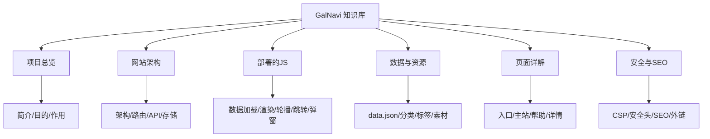

# 🗺️ GalNavi 知识库地图 (MOC)

> [!info] 关于本知识库
> 本知识库围绕开源项目 **GalNavi**（galnavi.top）构建，从**网站用途、目的、作用、部署的 JS、数据架构、页面、安全 SEO** 等多维度进行系统性整理。
> - 项目源仓库：[argb6/gal-navigation](https://github.com/argb6/gal-navigation)
> - 线上站点：[galnavi.top](https://galnavi.top)
> - 知识库构建日期：2026-07-08

## 🔭 一句话理解 GalNavi

GalNavi 是一个**专注于 ACG / Galgame 圈的开源纯净导航站**，部署在 Cloudflare 边缘网络上，把分散的资源站点、模拟器、工具、会社、汉化组信息聚合到一个无广告、秒速响应的界面里，并为每个站点整理介绍、标签、官方矩阵链接，让寻找资源不再依赖搜索引擎。

## 📚 多维度导航

按维度选择入口，每个维度下有详细笔记并用双向链接互相关联。

### 1️⃣ 项目总览维度 —— 它是什么、为什么、做什么
- [GalNavi 项目简介](01-项目总览/GalNavi 项目简介.md) — 定位、起源、核心理念
- [为什么开发 GalNavi（目的与动机）](01-项目总览/为什么开发 GalNavi（目的与动机）.md) — 痛点与设计初衷
- [GalNavi 的作用与价值](01-项目总览/GalNavi 的作用与价值.md) — 对用户与社区的实际作用
- [开源与社区](01-项目总览/开源与社区.md) — MIT 协议、GitHub、Discord、反馈渠道

### 2️⃣ 网站架构维度 —— 怎么搭起来的
- [整体技术架构](02-网站架构/整体技术架构.md) — Cloudflare + SSR + SPA 混合架构全景
- [路由与页面体系](02-网站架构/路由与页面体系.md) — `/`、`/nav/`、`/nav/help/`、`/nav/about/` 与 hash 路由
- [API 端点清单](02-网站架构/API 端点清单.md) — `/nav/api/nav`、`/nav/api/hero`、`/nav/api/featured`
- [存储层 D1 与 KV](02-网站架构/存储层 D1 与 KV.md) — D1 数据库 vs KV 键值存储的分工
- [请求与渲染流程](02-网站架构/请求与渲染流程.md) — 从访问到首屏的完整数据流

### 3️⃣ 部署的 JS 维度 —— 代码怎么跑的（核心）
- [内联 JS 总览与加载策略](03-部署的JS/内联 JS 总览与加载策略.md) — 三段式内联脚本与 CSP 约束
- [数据预加载脚本（D1 载入）](03-部署的JS/数据预加载脚本（D1 载入）.md) — `window.__DATA_PROMISE__`
- [主应用逻辑脚本（卡片与交互）](03-部署的JS/主应用逻辑脚本（卡片与交互）.md) — init / render / filter / search
- [轮播图脚本（Hero Carousel）](03-部署的JS/轮播图脚本（Hero Carousel）.md) — KV 优先 + fallback
- [外链跳转脚本（Redirect 倒计时）](03-部署的JS/外链跳转脚本（Redirect 倒计时）.md) — 安全跳转机制
- [入口页发布页弹窗脚本](03-部署的JS/入口页发布页弹窗脚本.md) — release-modal 模态框
- [帮助页侧栏与锚点脚本](03-部署的JS/帮助页侧栏与锚点脚本.md) — IntersectionObserver 滚动高亮
- [XSS 防护与 escapeHtml](03-部署的JS/XSS 防护与 escapeHtml.md) — 输入转义函数

### 4️⃣ 数据与资源维度
- [data.json 数据结构](04-数据与资源/data.json 数据结构.md) — 29 条站点的字段与分类
- [收录站点分类（模拟器与网站）](04-数据与资源/收录站点分类（模拟器与网站）.md) — 两类资源
- [标签体系](04-数据与资源/标签体系.md) — 资源站/ACG/网盘/魔法等标签语义
- [图片素材资源](04-数据与资源/图片素材资源.md) — hero / mascot / emoji / icon
- [GitHub 仓库的角色](04-数据与资源/GitHub 仓库的角色.md) — 仓库只存数据不存代码

### 5️⃣ 页面详解维度
- [入口页（永久发布页）](05-页面详解/入口页（永久发布页）.md) — `/` 的门户作用
- [主站导航页](05-页面详解/主站导航页.md) — `/nav/` 的六大视图
- [帮助页](05-页面详解/帮助页.md) — `/nav/help/` 的使用指南
- [关于页](05-页面详解/关于页.md) — `/about` 关于页
- [详情与外链跳转](05-页面详解/详情与外链跳转.md) — 介绍详情展开与安全跳转

### 6️⃣ 安全与 SEO 维度
- [内容安全策略 CSP](06-安全与SEO/内容安全策略 CSP.md) — 严格的源白名单
- [安全响应头](06-安全与SEO/安全响应头.md) — HSTS、nosniff 等
- [SEO 与可发现性](06-安全与SEO/SEO 与可发现性.md) — sitemap、robots、meta、OG
- [外链安全设计](06-安全与SEO/外链安全设计.md) — noopener noreferrer + 倒计时跳转

## 🔗 快速链接

- [00 知识库地图 (MOC)](00 知识库地图 (MOC).md) ← 你在这里
- 所有笔记的索引见本页
- 需要查代码细节 → [内联 JS 总览与加载策略](03-部署的JS/内联 JS 总览与加载策略.md)
- 需要理解数据 → [data.json 数据结构](04-数据与资源/data.json 数据结构.md)

## 📝 元信息

| 项 | 值 |
|---|---|
| 项目名 | GalNavi (GALNAVI) |
| 域名 | galnavi.top |
| 仓库 | github.com/argb6/gal-navigation |
| 许可证 | MIT |
| 部署平台 | Cloudflare (Workers/Pages + D1 + KV) |
| 语言 | 中文 (zh-CN) |
| 领域 | ACG / Galgame 资源导航 |

