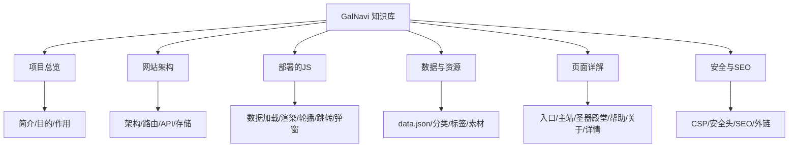

# 🗺️ GalNavi 知识库地图 (MOC)

> [!info] 关于本知识库
> 本知识库围绕开源项目 **GalNavi**（galnavi.top）构建。
> - 项目源仓库：[argb6/gal-navigation](https://github.com/argb6/gal-navigation)
> - 线上站点：[galnavi.top](https://galnavi.top)

## 🔭 一句话理解 GalNavi

GalNavi 是一个**专注于 ACG / Galgame 圈的开源纯净导航站**，部署在 Cloudflare 边缘网络上，把分散的资源站点、模拟器、工具、会社、汉化组信息聚合到一个无广告、秒速响应的界面里。

## 📚 多维度导航

### 1️⃣ 项目总览
- [[GalNavi项目简介]]
- [[为什么开发GalNavi（目的与动机）]]
- [[GalNavi的作用与价值]]
- [[开源与社区]]
- [[纳普吉祥物]] — 猫耳娘纳普：传说、声明、表情包与品牌标互动

### 2️⃣ 网站架构
- [[整体技术架构]]
- [[路由与页面体系]]
- [[API端点清单]]
- [[存储层D1与KV]]
- [[请求与渲染流程]]

### 3️⃣ 部署的 JS
- [[内联JS总览与加载策略]]
- [[数据预加载脚本（D1载入）]]
- [[主应用逻辑脚本（卡片与交互）]]
- [[轮播图脚本（HeroCarousel）]]
- [[外链跳转脚本(Redirect倒计时)]]
- [[入口页发布页弹窗脚本]]
- [[帮助页侧栏与锚点脚本]]
- [[XSS防护与escapeHtml]]

### 4️⃣ 数据与资源
- [[data.json数据结构]]
- [[标签体系]]
- [[图片素材资源]]
- [[GitHub仓库的角色]]

### 5️⃣ 页面详解
- [[入口页（永久发布页）]]
- [[主站导航页]]
- [[圣器殿堂]]
- [[帮助页]]
- [[关于页]]
- [[详情与外链跳转]]

### 6️⃣ 安全与 SEO
- [[内容安全策略CSP]]
- [[安全响应头]]
- [[SEO与可发现性]]
- [[外链安全设计]]

## 🔗 快速链接

- 总览图 → [[网站框架总览]]
- 代码细节 → [[内联JS总览与加载策略]]
- 数据 → [[data.json数据结构]]

## 📝 元信息

| 项 | 值 |
|---|---|
| 项目名 | GalNavi (GALNAVI) |
| 域名 | galnavi.top |
| 仓库 | argb6/gal-navigation |
| 许可证 | MIT |
| 部署 | Cloudflare Workers + D1 + KV |
| 语言 | 中文 (zh-CN) |
| 领域 | ACG / Galgame 资源导航 |

