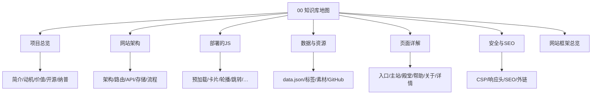

# 🗺️ GalNavi 知识库地图 (MOC)

> [!info] 关于本知识库
> 本知识库围绕开源项目 **GalNavi**（galnavi.top）构建。
> - 项目源仓库：[argb6/gal-navigation](https://github.com/argb6/gal-navigation)
> - 线上站点：[galnavi.top](https://galnavi.top)

## 🔭 一句话理解 GalNavi

GalNavi 是一个**专注于 ACG / Galgame 圈的开源纯净导航站**，部署在 Cloudflare 边缘网络上，把分散的资源站点、模拟器、工具、会社、汉化组信息聚合到一个无广告、秒速响应的界面里。

## 📚 分节导航

主地图**只链到各节索引**；细节笔记在对应文件夹索引里展开。

| 章节 | 索引 | 内容 |
|---|---|---|
| 1️⃣ 项目总览 | [[项目总览]] | 定位、动机、价值、开源、纳普 |
| 2️⃣ 网站架构 | [[网站架构]] | 架构、路由、API、存储、请求流 |
| 3️⃣ 部署的 JS | [[部署的JS]] | 内联脚本与加载策略 |
| 4️⃣ 数据与资源 | [[数据与资源]] | data.json、标签、素材、仓库角色 |
| 5️⃣ 页面详解 | [[页面详解]] | 入口 / 主站 / 殿堂 / 帮助 / 关于 / 详情 |
| 6️⃣ 安全与 SEO | [[安全与SEO]] | CSP、响应头、SEO、外链安全 |

## 🔗 全站总图

- [[网站框架总览]] — Mermaid 路由 / 存储 / 数据流（跨节一览，不替代分节索引）

## 📝 元信息

| 项 | 值 |
|---|---|
| 项目名 | GalNavi (GALNAVI) |
| 域名 | galnavi.top |
| 仓库 | argb6/gal-navigation |
| 许可证 | MIT |
| 部署 | Cloudflare Workers + D1 + KV |
| 语言 | 中文 (zh-CN) |
| 领域 | ACG / Galgame 资源导航 |

