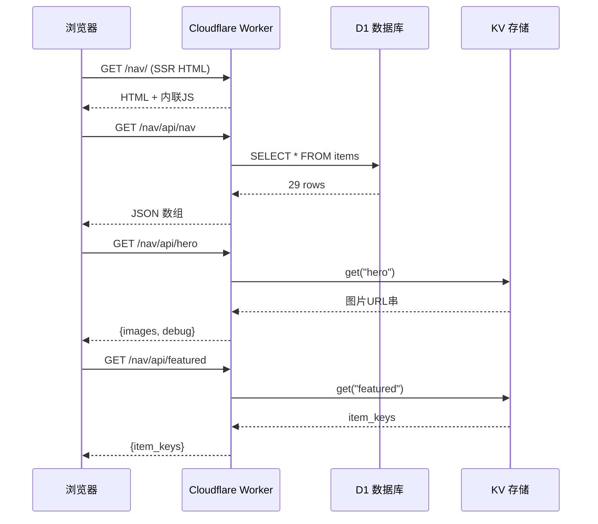

# API 端点清单

> ！实测确认的 3 个真实 API
> 
> 全部位于 `/nav/api/*` 下，返回 `application/json`，由主站客户端 JS 调用。

## 端点总览

| 端点 | 方法 | 存储 | 用途 | 返回大小 |
|---|---|---|---|---|
| `/nav/api/nav` | GET | **D1** | 站点核心数据 | ~9.2 KB |
| `/nav/api/hero` | GET | **KV** | 轮播图图片列表 | ~463 B |
| `/nav/api/featured` | GET | **KV** | 站长推荐 item_keys | ~41 B |

> ⚠️ **注意**：`/nav/group/`（神魔殿堂）页面直接查询 D1，不提供独立 API 端点。数据由 `group.js` Worker 从独立的 D1 绑定（`group` → `resources` 表）查询。详见 [神魔殿堂](神魔殿堂.md)。

## 1. `/nav/api/nav` —— D1 站点数据

**存储**：Cloudflare D1（SQLite）
**用途**：返回所有站点/模拟器条目，供卡片渲染

### 请求
```
GET /nav/api/nav
```
客户端调用时带 `cache: 'no-cache'` 与 10 秒 `AbortController` 超时。

### 响应结构
```json
[
  {
    "item_key": "joiplay",
    "title": "Joiplay",
    "category": "simulators",
    "tags": "安卓,rpg,多功能,插件化",
    "short_desc": "独特的插件生态",
    "url": "",
    "icon_path": "https://joiplay.net/assets/images/icon.png"
  },
  ...
]
```

### 字段说明
| 字段 | 类型 | 说明 |
|---|---|---|
| `item_key` | string | 唯一标识（也作 D1 主键，featured 引用它）|
| `title` | string | 显示名称 |
| `category` | string | `simulators` / `websites` / `tools` / `company` / `hanhua` |
| `tags` | string | 逗号分隔的标签串（前端 split 成数组）|
| `short_desc` | string | 一句话简介 |
| `url` | string | 主站链接（模拟器类为空）|
| `icon_path` | string | 图标 URL |

### 客户端格式化
前端拿到后做映射（见 [数据预加载脚本（D1 载入）](数据预加载脚本（D1载入）.md)）：
```javascript
const CAT_MAP = {
  simulators: 'simulator', websites: 'site',
  tools: 'tool', company: 'company', hanhua: 'hanhua'
};
// 转成 {id, cat, name, desc, tags[], url, icon}
```

> 该端点返回线上 D1 数据（29 条），与 GitHub 仓库 `docs/data.json`（26 条）**字段结构一致但条目滞后**——D1 比仓库多 3 条网站。说明 D1 是权威源，仓库 data.json 是滞后镜像。详见 [data.json 数据结构](data.json数据结构.md)。

### 源码实现细节（websearch.js）
- **SQL**：`SELECT item_key, title, category, tags, short_desc, url, icon_path FROM <表名> ORDER BY category ASC`（参数化，无注入风险）
- **图标路径补全**：`icon_path` 若以 `./` 开头，会拼接 GitHub raw 基址 `https://raw.githubusercontent.com/argb6/gal-navigation/main`
- **CORS**：`Access-Control-Allow-Origin: https://galnavi.top`（仅允许同源）
- **D1 绑定**：通过 `env.<D1绑定名>` 访问
- **错误处理**：D1 未配置返回 500，异常返回 500

## 2. `/nav/api/hero` —— KV 轮播图

**存储**：Cloudflare KV（轮播图专用 namespace）
**用途**：返回主站顶部轮播图图片 URL 列表

### 响应结构
```json
{
  "images": [
    "https://raw.githubusercontent.com/argb6/gal-navigation/main/docs/hero/hero1.png",
    "https://raw.githubusercontent.com/argb6/gal-navigation/main/docs/hero/hero2.png",
    "https://raw.githubusercontent.com/argb6/gal-navigation/main/docs/hero/hero3.png"
  ],
  "debug": "heroJson length=241, first 80 chars=..., | JSON parse error: ..."
}
```

### 注意点
- 当前响应含 `debug` 字段，说明 KV 中存的原始值是**纯字符串**（非 JSON 数组），Worker 尝试 `JSON.parse` 失败后回退处理。正式模式应返回纯数组。
- **Worker 容错解析**（源码确认）：先 `JSON.parse` → 失败则按逗号分割 → 再失败当作单元素数组，保证总返回 images 数组
- 图片指向 **GitHub raw**（`raw.githubusercontent.com/argb6/gal-navigation/main/docs/hero/`），验证了仓库作为静态资源 CDN 的角色。
- 客户端有 `HERO_FALLBACK = []` 兜底（当前为空数组，KV 失败时轮播为空）。

详见 [轮播图脚本（Hero Carousel）](轮播图脚本（HeroCarousel）.md)。

## 3. `/nav/api/featured` —— KV 站长推荐

**存储**：Cloudflare KV（推荐专用 namespace）
**用途**：返回被推荐的站点 item_key 列表；支持 GET 读取 + POST 写入

### 响应结构
```json
{
  "item_keys": ["灵梦御所", "touchgal"]
}
```

### 客户端逻辑
- KV 优先：若 featured 有数据，按 item_keys 顺序展示
- Fallback：若 KV 为空，用标签匹配算法挑选推荐
- **同步回写 KV**：fallback 计算出推荐后，会 POST `/nav/api/featured`（Worker 写入推荐 KV 绑定）写入 KV，让后续请求直接命中（自愈机制）
- **CORS**：支持 OPTIONS 预检（`GET, POST, OPTIONS`），`Access-Control-Allow-Origin: https://galnavi.top`

详见 [主应用逻辑脚本（卡片与交互）](主应用逻辑脚本（卡片与交互）.md) 的 featured 部分。

## 神魔殿堂 D1 查询（非 API 端点）

> ⚠️ 神魔殿堂页面不提供独立的 JSON API 端点，数据由 `group.js` Worker 在服务端直接查询 D1 并 SSR 渲染为 HTML。

### D1 查询（group.js）

**存储**：Cloudflare D1（独立 `group` 绑定）
**用途**：返回神器、魔器、仙器三类特殊资源，供神魔殿堂页面渲染

### 查询方式

```javascript
const { results } = await env.group.prepare(
  "SELECT * FROM resources ORDER BY category, id"
).all();
```

### resources 表结构

| 字段 | 类型 | 说明 | 必填 |
|---|---|---|---|
| `id` | INTEGER | 主键 | ✅ |
| `category` | TEXT | 分类（神器/魔器/仙器）| ✅ |
| `name` | TEXT | 器物名称 | ✅ |
| `official_url` | TEXT | 官网链接 | ❌ |
| `details_url` | TEXT | 详情页链接 | ❌ |
| `link1` | TEXT | 额外链接 1 | ❌ |
| `link2` | TEXT | 额外链接 2 | ❌ |
| `link3` | TEXT | 额外链接 3 | ❌ |

### 特点

- **独立 D1 绑定**：`env.group`，与主站站点数据（`navi_sites` 表）完全分离
- **纯查询操作**：无写操作，仅 `SELECT * FROM resources ORDER BY category, id`
- **SSR 渲染**：数据由 Worker 服务端渲染为 HTML，而非返回 JSON
- **容错处理**：数据库查询失败时返回空数组 `data = []`
- **缓存策略**：`Cache-Control: public, max-age=3600`（1 小时）

### 源码实现细节（group.js）

- **绑定名**：`group`
- **表名**：`resources`
- **排序**：先按 `category` 升序，再按 `id` 升序
- **HTML 转义**：所有数据库值通过 `escHtml()` 函数转义，防止 XSS
- **Worker**：`group.js`（788 行），详见 [神魔殿堂](神魔殿堂.md)

## 非真实端点（fallback）

以下路径虽返回 HTTP 200，但返回的是**入口页 HTML**（SPA fallback），**不是 JSON API**：
- `/api/items`、`/api/data`、`/api/sites`
- `/data.json`、`/go/`、`/entry`、`/main`、`/help`、`/about`

> 探测时务必看 `Content-Type`：真实 API 是 `application/json`，fallback 是 `text/html`。

## 调用关系图



## 相关笔记

- 存储分工 → [存储层 D1 与 KV](存储层D1与KV.md)
- 调用方 JS → [数据预加载脚本（D1 载入）](数据预加载脚本（D1载入）.md)
- 数据结构 → [data.json 数据结构](data.json数据结构.md)
- 上一级 → [00 知识库地图 (MOC)](00知识库地图(MOC).md)
