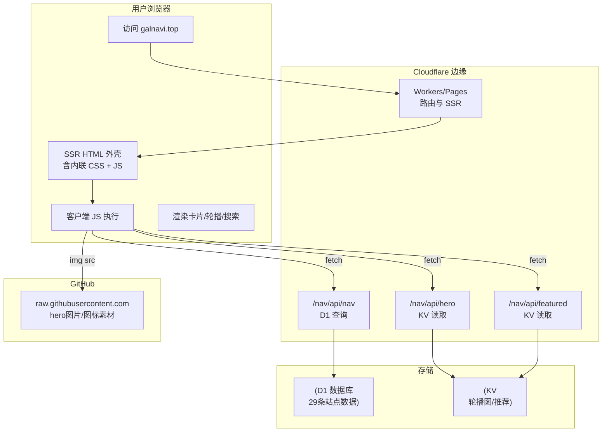

# 整体技术架构

> ！一图看懂
> 
> GalNavi 是部署在 **Cloudflare 边缘网络**上的应用，采用 **SSR（服务端渲染 HTML 外壳）+ 客户端 SPA（hash 路由动态渲染内容）** 的混合架构，所有 CSS/JS **内联**在 HTML 中，数据从 **D1 数据库**与 **KV 存储**动态获取。

## 架构全景



## 技术栈构成

### 1. 部署与运行时
- **平台**：Cloudflare Workers（`Server: cloudflare`，`CF-RAY` 头确认）
- **形态**：多路由独立 SSR，各司其职：
  - 入口页（永久发布页）
  - 主站 + 全部 API（含 D1 / KV 查询）
  - 详情页（读站点详情 Markdown）
  - 帮助页、关于页、圣器殿堂
- **存储**：主站 D1 + 殿堂 D1；轮播与推荐各用独立 KV
- **边缘节点**：示例 `CF-RAY: a17e...-LAX`（洛杉矶节点）

### 2. 前端
- **无框架**：原生 JavaScript，无 React/Vue 等
- **无构建**：无打包工具痕迹，无外部 JS/CSS 文件
- **内联策略**：所有 CSS 用 `<style>` 内联，所有 JS 用 `<script>` 内联
- **单页应用**：通过 `history.pushState` + hash 路由切换视图（详见 [路由与页面体系](路由与页面体系.md)）

### 3. 后端 / 数据
- **D1**（Cloudflare SQLite 数据库）：存放站点核心数据 + 详情页 Markdown 内容（`md_content` 字段）（详见 [存储层 D1 与 KV](存储层D1与KV.md)）
- **KV**（两个独立 namespace）：一个存轮播图、一个存站长推荐（低频变更、需快速读取）

### 4. 安全
- 严格 CSP（详见 「内容安全策略 CSP」）
- HSTS、X-Content-Type-Options
- Cloudflare challenge-platform（JS 检测）

## 架构特点与权衡

### ✅ 优势
| 特点 | 收益 |
|---|---|
| 全内联 CSS/JS | 零额外请求，首屏快，部署简单 |
| 边缘 SSR | 全球低延迟，SEO 友好（HTML 直出）|
| D1 + KV 分工 | 结构化数据用 D1，配置型数据用 KV，各取所长 |
| 客户端 SPA | 切换视图无刷新，体验流畅 |
| KV fallback 机制 | KV 失败有硬编码兜底，可用性高 |

### ⚠️ 权衡 / 注意点
| 特点 | 影响 |
|---|---|
| 全内联 | HTML 较大（主站 1.28MB），但仅一次请求 |
| 仓库无源码 | 可维护性依赖开发者本地，社区难贡献代码 |
| `unsafe-inline` in CSP | 为内联脚本必须，略降 CSP 强度 |
| 客户端 fetch 数据 | 首屏需等 API 返回后才渲染卡片 |

## 与 README 框架图的对应

README 给出的框架图（简化）：

```
[ 入口 ] → [ 主站 ]
              ├── 轮播图模块 ──(调取信息)──> 【KV 存储】
              ├── 卡片模块   ──(调取数据)──> 【D1 数据库】
              └── 其它分支（介绍详情/帮助/关于）
```

这与实测完全吻合：
- 轮播图 → `/nav/api/hero`（KV）✓
- 卡片 → `/nav/api/nav`（D1）✓
- 推荐模块 → `/nav/api/featured`（KV）✓（README 未画但实际存在）

## 相关笔记

- 上一级 → [[网站架构]]
- 相关 → [[路由与页面体系]]
