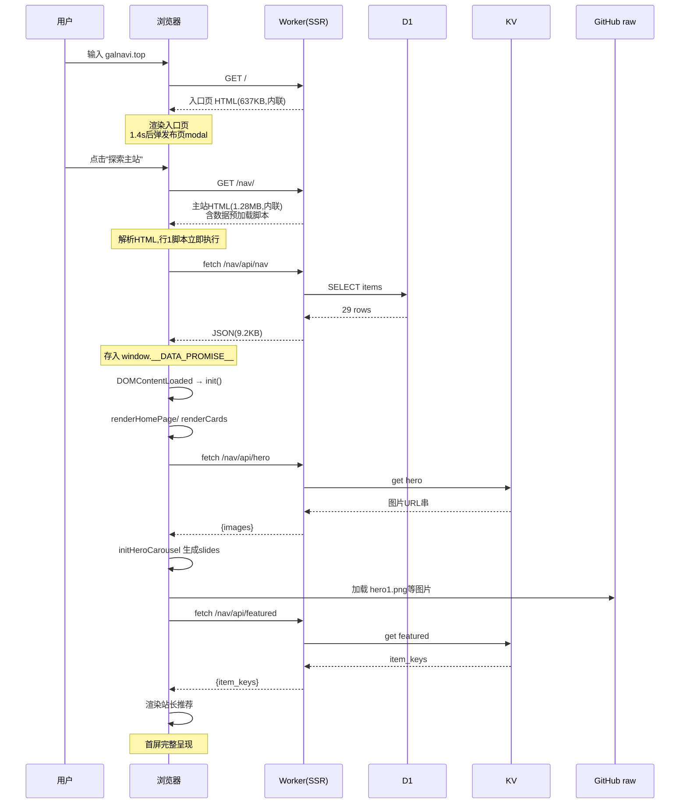

# 请求与渲染流程

> [!summary] 
> 从用户访问到看到完整卡片，经历：**URL 路由 → SSR HTML 外壳下发 → 内联数据预加载脚本 fetch D1 → DOMContentLoaded 触发 init → 渲染卡片/轮播/推荐 → 用户交互（搜索/切换/跳转）**。

## 首屏加载完整流程



## 分阶段详解

### 阶段 1：入口页（`/`）
1. 用户访问 `galnavi.top` → Worker 返回入口页 HTML（637KB，全内联）
2. HTML 解析后渲染：暗色背景 + 玻璃拟态 logo + "探索主站"按钮
3. `window load` 后延迟 **1400ms** 自动弹出"永久发布页"modal（若 sessionStorage 未标记已关闭）
4. 用户点击"探索主站" → 跳转 `/nav/`

详见 [入口页（永久发布页）](../05-页面详解/入口页（永久发布页）.md)。

### 阶段 2：主站 HTML 下发（`/nav/`）
Worker 返回 1.28MB 的 HTML，结构：
```
<script> 数据预加载(D1 fetch) </script>   ← 行1，立即执行
<!DOCTYPE html>
<head> CSP + meta + <style>全部CSS</style> </head>
<body> 导航栏 + 6个view区块 + 轮播 + 跳转层 + <script>主应用JS</script> </body>
<script> Cloudflare challenge </script>
```

> 关键：**数据预加载脚本放在 HTML 最前面（DOCTYPE 之前）**，使其尽早发起 fetch，与后续 HTML 解析并行，缩短首屏等待。

### 阶段 3：数据预加载（D1）
行1脚本（详见 [数据预加载脚本（D1 载入）](../03-部署的JS/数据预加载脚本（D1 载入）.md)）：
```javascript
window.__DATA_PROMISE__ = (async function(){
  const ctrl1 = new AbortController();
  const t1 = setTimeout(() => ctrl1.abort(), 10000);  // 10s 超时
  const response = await fetch('/nav/api/nav', { cache: 'no-cache', signal: ctrl1.signal });
  const d1Data = await response.json();
  // 格式化: category 映射, tags split
  return { items: formattedItems };
})();
```
- 超时保护：10 秒
- 失败返回 `null`（主应用会处理 null 情况）
- 结果挂到全局 `window.__DATA_PROMISE__`（一个 Promise）

### 阶段 4：主应用 init
行948脚本在 DOM 解析后执行 `init()`：
1. 绑定 nav-link 点击 → `navigateTo(page)`
2. 绑定 logo 点击 → 回首页
3. 绑定搜索框 input → `filterByKeyword`
4. `await window.__DATA_PROMISE__` 取数据
5. `renderHomePage()` / `renderCards()` 渲染

详见 [主应用逻辑脚本（卡片与交互）](../03-部署的JS/主应用逻辑脚本（卡片与交互）.md)。

### 阶段 5：轮播与推荐
- `initHeroCarousel()`：fetch `/nav/api/hero`，失败用 `HERO_FALLBACK`（当前空），生成 slide 元素，4 秒自动切换
- 站长推荐：fetch `/nav/api/featured`，KV 空则标签匹配 + 回写 KV

### 阶段 6：用户交互
- **切换视图**：`navigateTo` → pushState + 切 view active + renderPageContent
- **搜索**：input 事件 → `filterByKeyword`（匹配 name + tags）→ 重渲染卡片 + 高亮关键词
- **点标签**：`data-tag` → 联动搜索框筛选
- **点外链**：`startRedirect` → 弹 3 秒倒计时层 → `window.open(url, '_blank', 'noopener,noreferrer')`
- **浏览器前进/后退**：`popstate` 事件 → `navigateTo(page, false)` 不入栈

## 性能特征

| 指标 | 表现 | 说明 |
|---|---|---|
| HTML 体积 | 主站 1.28MB | 全内联，单次请求 |
| 请求数 | 1 HTML + 3 API + N 图片 | 极少 |
| 首屏依赖 | D1 数据返回 | 卡片在数据到位后渲染 |
| 边缘缓存 | KV 项命中边缘 | hero/featured 极快 |
| 图片源 | GitHub raw + 各站图标 | 依赖第三方 CDN |

## 失败兜底

| 失败点 | 兜底 |
|---|---|
| D1 fetch 超时/失败 | `__DATA_PROMISE__` 返回 null，主应用显示空/错误态 |
| hero KV 失败 | 用 `HERO_FALLBACK`（当前空数组→无轮播）|
| featured KV 为空 | 标签匹配本地计算 + 回写 KV |
| 图标加载失败 | 显示默认 🔗 emoji |

## 相关笔记

- 各脚本细节 → [内联 JS 总览与加载策略](../03-部署的JS/内联 JS 总览与加载策略.md)
- API → [API 端点清单](API 端点清单.md)
- 上一级 → [00 知识库地图 (MOC)](../00 知识库地图 (MOC).md)
