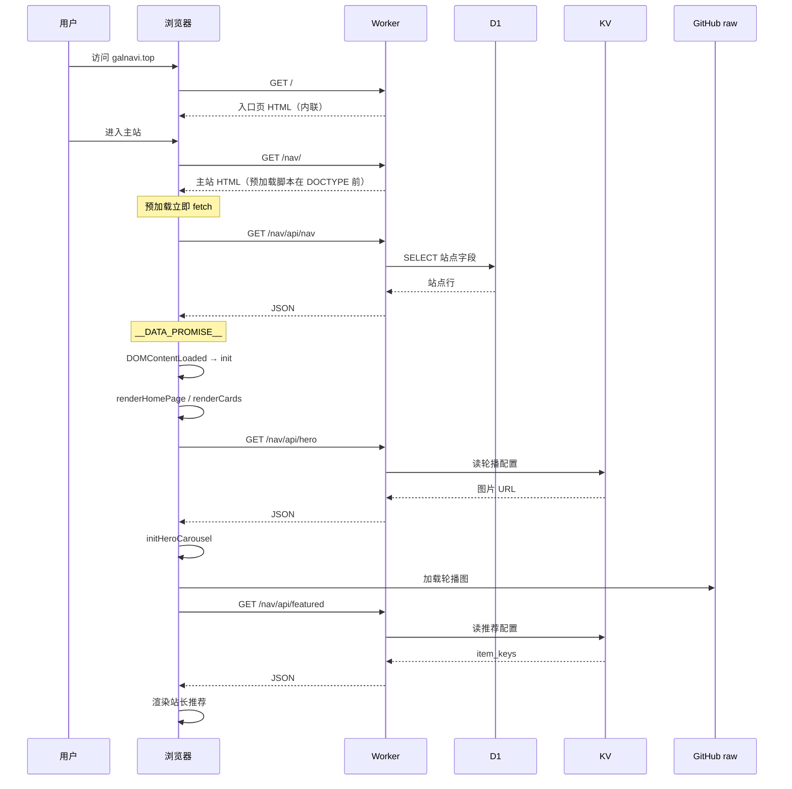

# 请求与渲染流程

> [!info]
>
> 访问到完整卡片：**路由 → SSR HTML → 预加载 fetch 站点数据 → init → 渲染卡片/轮播/推荐 → 交互**。

## 首屏流程



## 分阶段

### 1. 入口页 `/`
SSR 入口 HTML；加载后可自动弹出发布页弹窗（session 未关闭时）。详见 [[入口页（永久发布页）]]。

### 2. 主站 HTML `/nav/`
结构概要：
```
<script> 预加载：escapeHtml / isSafeHttpUrl / fetch /nav/api/nav </script>
<!DOCTYPE html>
<head> CSP + meta + 内联 CSS </head>
<body> 导航 + 多 view + 轮播 + 跳转层 + 主应用脚本 </body>
```

预加载在 DOCTYPE 前，与 HTML 解析并行。

### 3. 数据预加载
10s 超时；失败返回 `null`。详见 [[数据预加载脚本（D1载入）]]。

### 4. 主应用 init
绑定导航 / 搜索 → `await __DATA_PROMISE__` → 渲染。详见 [[主应用逻辑脚本（卡片与交互）]]。

### 5. 轮播与推荐
- 轮播：`/nav/api/hero`，失败用空 fallback
- 推荐：`/nav/api/featured`，空则本地「推荐」标签匹配（只读，不写回）

### 6. 交互
- `navigateTo` hash 路由
- 搜索 / 点标签筛选
- 外链 → `startRedirect` 3 秒倒计时
- `popstate` 前进后退

## 性能与兜底

| 点 | 说明 |
|---|---|
| HTML 体积 | 主站约 1～2MB 量级（全内联，单次请求）|
| 请求 | 1 HTML + 3 API + 图片 |
| D1 失败 | `__DATA_PROMISE__` → null，空态 |
| 轮播失败 | 无轮播 |
| 推荐为空 | 标签 fallback |
| 图标失败 | 默认占位 |

## 相关笔记

- [[数据预加载脚本（D1载入）]]
- [[主应用逻辑脚本（卡片与交互）]]
- [[轮播图脚本（HeroCarousel）]]
- [[外链跳转脚本(Redirect倒计时)]]
- [[00知识库地图(MOC)]]
