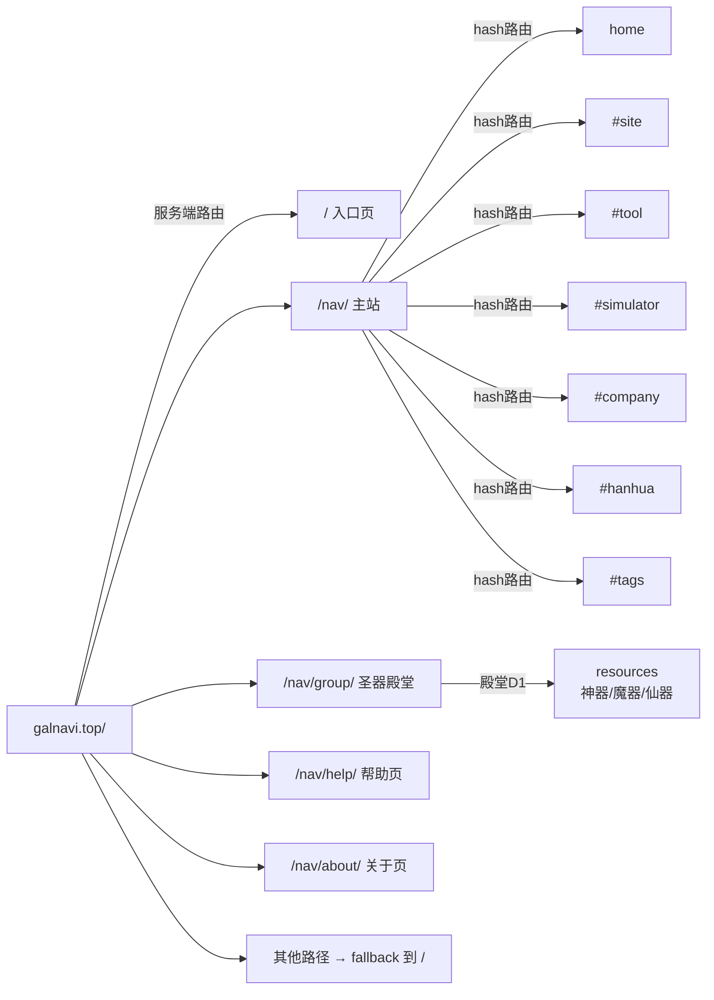

# 路由与页面体系

> [!info] 核心结论
>
> GalNavi 有 **两层路由**：服务端路由（不同 URL 返回不同 SSR 页面）+ 客户端 hash 路由（主站内切换视图）。

## 服务端路由

| URL | 页面 | 说明 |
|---|---|---|
| `/` | 入口页 | 永久发布页；另提供 robots / sitemap / favicon |
| `/nav/` | 主站导航页 | 核心交互与全部 API |
| `/nav/api/nav` | 站点列表 API | D1 |
| `/nav/api/hero` | 轮播图 API | KV |
| `/nav/api/featured` | 推荐 API | KV（GET 公开；写入仅运维）|
| `/nav/detail/` | 详情页 | 读站点详情 Markdown |
| `/nav/group/` | [[圣器殿堂]] | 神器 / 魔器 / 仙器 |
| `/nav/help/` | 帮助页 | 使用指南 |
| `/nav/about/` | 关于页 | 起源传说与声明 |

### sitemap.xml

```xml
<urlset>
  <url><loc>https://galnavi.top/</loc><priority>1.0</priority></url>
  <url><loc>https://galnavi.top/nav/</loc><priority>1.0</priority></url>
  <url><loc>https://galnavi.top/nav/detail/</loc><priority>0.8</priority></url>
  <url><loc>https://galnavi.top/nav/about/</loc><priority>0.8</priority></url>
  <url><loc>https://galnavi.top/nav/group/</loc><priority>0.8</priority></url>
  <url><loc>https://galnavi.top/nav/help/</loc><priority>0.8</priority></url>
</urlset>
```

具体 `?item_key=` 详情页不逐条收录。未匹配路径通常 fallback 到入口页 HTML。

## 客户端 hash 路由（主站）

| data-nav | hash | 说明 |
|---|---|---|
| `home` | （空）| 首页：轮播 + 推荐 + 最近更新 |
| `site` | `#site` | 资源网站 |
| `tool` | `#tool` | 工具 |
| `simulator` | `#simulator` | 模拟器 |
| `company` | `#company` | 会社 |
| `hanhua` | `#hanhua` | 汉化组 |
| — | `#tags` | 标签云 |

由 `navigateTo(page)` 切换；`home` 对应空 hash。

## robots.txt

```
User-agent: *
Allow: /
Sitemap: https://galnavi.top/sitemap.xml
```

## 关系图



## 相关笔记

- [[圣器殿堂]]
- [[关于页]]
- [[API端点清单]]
- [[主应用逻辑脚本（卡片与交互）]]
- [[00知识库地图(MOC)]]
