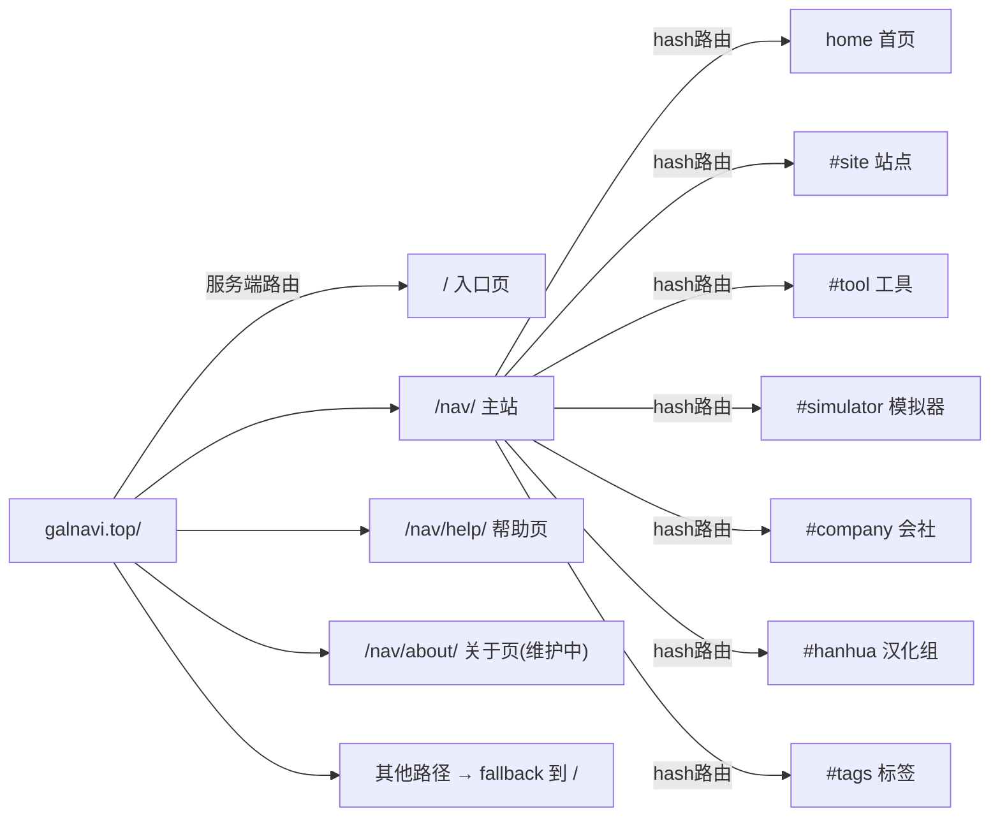

# 路由与页面体系

> ！核心结论
> 
> GalNavi 有 **两层路由**：服务端路由（不同 URL 返回不同 SSR 页面）+ 客户端 hash 路由（主站内切换视图）。sitemap.xml 只收录 3 个真实页面。

## 服务端路由（真实页面）

通过源码（`galnavi/*.js`）+ sitemap 确认的真实页面与对应 Worker：

| URL | Worker 文件 | 页面 | 说明 |
|---|---|---|---|
| `/` | `galnavi.js` | 入口页（永久发布页）| 永久发布页 + 更新日志 + 门户 |
| `/nav/` | `websearch.js` | 主站导航页 | 核心，含所有交互与 API |
| `/nav/api/nav` | `websearch.js` | D1 数据 API | 站点列表 JSON |
| `/nav/api/hero` | `websearch.js` | KV 轮播图 API | hero 图片 JSON |
| `/nav/api/featured` | `websearch.js` | KV 推荐 API | item_keys JSON（GET+POST）|
| `/nav/detail/*` | `detail.js` | 详情页 | 单站点详情（查 D1 md_content）|
| `/nav/help/` | `help.js` | 帮助页 | 使用指南 |
| `/about` | `about.js` | 关于页 | 猫耳娘传说、版权声明 |
| `/about`（moho）| `moho.js` | Clash 导航 & Plan 页 | Clash 客户端导航（独立功能）|

> 注：`about.js` 与 `moho.js` 路由同为 `/about`，实际部署时由路由分发决定哪个生效（`moho.js` 是 Clash 客户端导航 & Plan 页面，与常规关于页不同）。

### sitemap.xml 内容

```xml
<urlset>
  <url><loc>https://galnavi.top/</loc><priority>1.0</priority></url>
  <url><loc>https://galnavi.top/nav/</loc><priority>1.0</priority></url>
  <url><loc>https://galnavi.top/nav/help/</loc><priority>0.8</priority></url>
</urlset>
```

只收录 3 个，`/nav/about/` 未收录（因当前是维护页）。

### 路由 fallback 行为

实测发现：**任何未匹配的路径都返回入口页 `/` 的内容**（HTTP 200，637KB）。例如：
- `/api/items` → 返回入口页 HTML
- `/go/` → 返回入口页 HTML
- `/main`、`/help`、`/entry` → 均返回入口页

这是 Workers/Pages 典型的 SPA-fallback / catch-all 行为，但注意：**主站 `/nav/` 内部不是 fallback，而是独立 SSR 页面**（返回 1.28MB 不同内容）。

## 客户端 hash 路由（主站内部）

主站 `/nav/` 是一个 SPA，通过 `history.pushState` + hash 切换视图。

### 导航视图（6 个 + 标签页）

通过 `navigateTo(page)` 函数切换，对应 DOM 中的 `view-*` 区块：

| data-nav | 视图 ID | 标签文案 | 说明 |
|---|---|---|---|
| `home` | `view-home` | （首页）| 站长推荐 + 最近更新 + 轮播 |
| `site` | `view-site` | 站点 | 资源网站 |
| `tool` | `view-tool` | 工具 | 工具类 |
| `simulator` | `view-simulator` | 模拟器 | Galgame 模拟器 |
| `company` | `view-company` | 会社 | 游戏制作公司 |
| `hanhua` | `view-hanhua` | 汉化组 | 汉化组 |
| — | `view-tags` | 标签 | 标签云视图 |

### 路由函数 navigateTo（简化）

```javascript
function navigateTo(page, pushState) {
    if (pushState !== false) {
        var hash = page === 'home' ? '' : '#' + page;
        var url = window.location.pathname + (hash ? hash : '');
        if (window.location.hash !== (hash || '#')) {
            history.pushState({ page: page }, '', url);
        }
    }
    // ...更新 nav-link active 状态
    // ...切换 view-* 区块的 active class
    // ...updateAllCounts / renderPageContent / closeDrawer / scrollTo top
}
```

特点：
- `home` 页对应空 hash（URL 干净）
- 其他页对应 `#site`、`#tool` 等
- 切换时同步更新激活态、计数、内容、关闭抽屉、滚动到顶

### 详情视图
点击卡片"介绍详情"会展开该站点介绍（同页内展开，非独立路由）。外链点击触发跳转确认层（见 [外链跳转脚本（Redirect 倒计时）](外链跳转脚本（Redirect倒计时）.md)）。

## robots.txt

```
User-agent: *
Allow: /
Sitemap: https://galnavi.top/sitemap.xml
```

完全开放抓取。

## 页面与路由关系图



## 相关笔记

- 各页面详解 → [入口页（永久发布页）](入口页（永久发布页）.md) 等
- 路由背后的 JS → [主应用逻辑脚本（卡片与交互）](主应用逻辑脚本（卡片与交互）.md)
- API 路由 → [API 端点清单](API端点清单.md)
- 上一级 → [00 知识库地图 (MOC)](00知识库地图(MOC).md)
