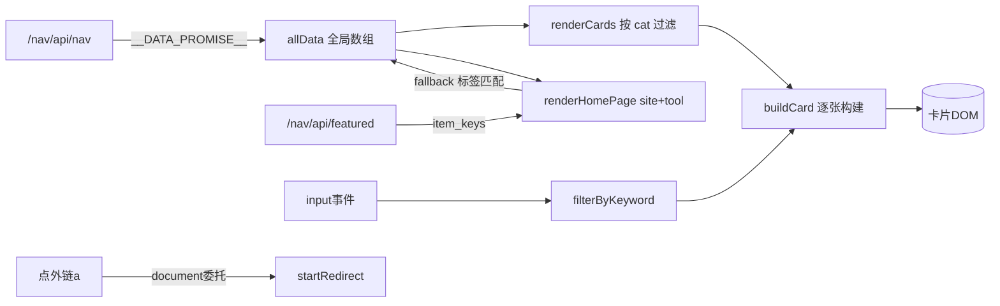

# 主应用逻辑脚本（卡片与交互）

> ！位置
> 
> 主站 `/nav/` 主应用脚本，负责初始化、路由、卡片渲染、搜索过滤、标签统计、轮播、外链拦截。

## 职责总览

```
init()                          ← 入口
  ├── 绑定 nav-link / logo / 标签按钮 → navigateTo
  ├── setupDrawer()             ← 移动端抽屉
  ├── initHeroCarousel()        ← 轮播（独立笔记）
  ├── setupNavSearch()          ← 搜索框
  └── await __DATA_PROMISE__    ← 取 D1 数据
        ├── renderHomePage()    ← 首页（推荐+最近更新）
        └── navigateTo(initial) ← 或跳初始页

navigateTo(page)                ← hash 路由
  ├── history.pushState
  ├── 切换 view-* active
  ├── updateAllCounts(page)
  ├── renderPageContent(page)
  └── closeDrawer() / scrollTo

renderPageContent(page)
  ├── renderCards(cat)          ← 各分类卡片
  ├── renderTagsPage()          ← 标签云
  └── renderHomePage()          ← 首页

全局事件委托
  ├── 点击 .tag-badge → 填搜索框筛选
  └── 点击外部 a → startRedirect 倒计时（独立笔记）
```

## 核心函数详解

### 1. init() —— 入口

```javascript
function init() {
    // 导航点击
    document.querySelectorAll('.nav-link').forEach(link => {
        link.addEventListener('click', function() {
            var page = this.dataset.nav;
            if (page) navigateTo(page);
        });
    });
    // logo → 首页
    document.querySelector('.nav-logo').addEventListener('click', function(e) {
        e.preventDefault(); navigateTo('home');
    });
    // 标签按钮 → 标签页
    var filterTagBtn = document.getElementById('filterTagBtn');
    if (filterTagBtn) filterTagBtn.addEventListener('click', ...);
    // 标签搜索框
    var tagSearchInput = document.getElementById('tagSearchInput');
    if (tagSearchInput) tagSearchInput.addEventListener('input', function() {
        renderTagsPage(this.value);
    });

    setupDrawer();
    initHeroCarousel();
    setupNavSearch();

    // 从 URL hash 决定初始页
    var hash = window.location.hash.replace('#', '');
    var validPages = ['site','tool','simulator','company','hanhua','tags'];
    var initialPage = validPages.indexOf(hash) !== -1 ? hash : 'home';

    // 取 D1 数据后初始化
    window.__DATA_PROMISE__.then(function(result) {
        if (result && result.items) {
            allData = result.items;
            if (initialPage === 'home') {
                renderHomePage();
                updateAllCounts('home');
            } else {
                navigateTo(initialPage, false);  // false = 不入栈
            }
        }
    });

    // 浏览器前进/后退
    window.addEventListener('popstate', function(e) { ... });
}
```

**要点**：
- `validPages` 不含 `home`（home 是默认，对应空 hash）
- 初始页若是 home 则直接 `renderHomePage`，否则 `navigateTo(initial, false)`（`pushState:false` 避免重复入栈）
- `popstate` 处理浏览器前进后退，同样 `pushState:false`

### 2. navigateTo(page, pushState) —— hash 路由

```javascript
function navigateTo(page, pushState) {
    if (pushState !== false) {
        var hash = page === 'home' ? '' : '#' + page;
        var url = window.location.pathname + (hash ? hash : '');
        if (window.location.hash !== (hash || '#')) {
            history.pushState({ page: page }, '', url);
        }
    }
    // 离开首页时恢复首页默认布局
    if (currentPage === 'home' && page !== 'home') showHomeDefault();
    currentPage = page;
    // 更新 nav-link 激活态
    document.querySelectorAll('.nav-link').forEach(link => {
        link.classList.toggle('active', link.dataset.nav === page);
    });
    // 切换 view-* 区块
    document.querySelectorAll('.page-view').forEach(view => view.classList.remove('active'));
    var targetView = document.getElementById('view-' + page);
    if (targetView) targetView.classList.add('active');
    updateAllCounts(page);
    renderPageContent(page);
    closeDrawer();
    window.scrollTo({ top: 0, behavior: 'smooth' });
}
```

**要点**：
- `home` → 空 hash（URL 干净），其他 → `#site` 等
- 离开首页调用 `showHomeDefault()` 恢复布局（避免首页状态残留）
- 滚动到顶用 smooth 行为

### 3. buildCard(item, keyword) —— 卡片 HTML 构建

构建单张站点卡片，是渲染的核心。关键字段处理：

```javascript
function buildCard(item, keyword) {
    let cat = escapeHtml(item.cat || '');
    // 标签：最多显示 7 个，每个可点击（data-tag）
    let tagsHtml = item.tags && item.tags.length
        ? '<div class="card-tags">' + item.tags.slice(0, 5)
            .map(t => `<span class="tag-badge" data-tag="${escapeHtml(t)}">${escapeHtml(t)}</span>`)
            .join('') + '</div>'
        : '';

    // 图标：URL 用 ，否则当 emoji 文本，空则 🔗
    const iconUrl = item.icon || '';
    let ico;
    if (iconUrl && /^(https?:|\/|\.\.?\/)/.test(iconUrl)) {
        ico = ``;
    } else if (iconUrl) {
        ico = `<span style="font-size:22px">${iconUrl}</span>`;
    } else {
        ico = '<span style="font-size:22px">🔗</span>';
    }

    // 名称：搜索时高亮关键词
    const escapedName = escapeHtml(item.name || '');
    const escapedKeyword = keyword ? escapeRegExp(keyword) : '';
    const nameDisplay = keyword
        ? escapedName.replace(new RegExp(`(${escapedKeyword})`, 'gi'),
            '<span class="search-highlight">$1</span>')
        : escapedName;

    // 是否有有效 url
    let hasUrl = item.url && item.url !== 'https://...' && !item.url.startsWith('#');

    // 卡片结构：header(icon+title+subtitle) + tags + actions
    return '<div class="card" data-cat="' + cat + '">' +
        '...header...' + tagsHtml +
        '<div class="card-actions">' +
        (hasUrl
            ? '<a href="/nav/detail/?item_key=' + encodeURIComponent(item.id) + '" class="btn-detail">介绍详情</a>' +
              '<a href="' + escapeHtml(item.url) + '" target="_blank" rel="noopener noreferrer" class="btn-link">链接直达</a>'
            : '<span class="btn-detail disabled">介绍详情</span><span class="btn-link disabled">链接直达</span>') +
        '</div></div>';
}
```

**要点**：
- **所有用户/D1 数据经 `escapeHtml` 转义**（防 XSS，见 [XSS 防护与 escapeHtml](XSS防护与escapeHtml.md)）
- 标签限 7 个，避免过长
- 图标智能判断：URL→img，文本→emoji span，空→🔗
- 搜索高亮：用 `escapeRegExp` 转义关键词后正则替换包裹 `<span class="search-highlight">`
- **"介绍详情"指向 `/nav/detail/?item_key=xxx`**（详情页，见 [详情与外链跳转](../05-页面详解/详情与外链跳转.md)）
- "链接直达" `target="_blank" rel="noopener noreferrer"`，但会被全局拦截器改为倒计时（见下文）

### 4. filterByKeyword(items, keyword) —— 搜索

```javascript
function filterByKeyword(items, keyword) {
    if (!keyword) return items;
    return items.filter(item =>
        item.name.toLowerCase().includes(keyword) ||
        item.tags.some(t => t.toLowerCase().includes(keyword))
    );
}
```

**要点**：同时匹配**名称**与**任一标签**，大小写不敏感。简单高效的客户端过滤。

### 5. renderHomePage() —— 首页推荐

首页展示站长推荐 + 最近更新。推荐逻辑有三层 fallback：

```javascript
async function renderHomePage() {
    const allItems = allData.filter(item => item.cat === 'site' || item.cat === 'tool');
    let featured = [];
    let featuredFromKV = false;

    try {
        const resp = await fetch('/nav/api/featured', { cache: 'no-cache' });
        if (resp.ok) {
            const data = await resp.json();
            const keys = data.item_keys || [];
            if (keys.length > 0) {
                // 第一层：按 item_key 精确匹配
                const keySet = new Set(keys);
                featured = allItems.filter(item => keySet.has(item.id))
                    .map(...).slice(0, 6);
                // 第二层：item_key 无匹配 → 按 title 模糊匹配
                if (featured.length === 0) {
                    const lowerKeys = keys.map(k => k.toLowerCase());
                    featured = allItems
                        .filter(item => lowerKeys.includes(item.name.toLowerCase()))
                        .map(...).slice(0, 6);
                }
                featuredFromKV = featured.length > 0;
            }
        }
    } catch (e) { /* fallback */ }

    // 第三层：KV 为空 → 取标签含「推荐」的前 6 条
    if (!featuredFromKV) {
        featured = allItems.filter(item => item.tags.includes('推荐'))
            .slice(0, 6).map(...);
    }
    // ...渲染推荐区 + 最近更新区
}
```

**三层 fallback**：
1. KV `item_keys` 精确匹配 `item.id`
2. KV `item_keys` 按名称模糊匹配
3. KV 空 → 本地标签匹配（含「推荐」）

客户端只读推荐接口；写入由运维侧完成。详见 [[存储层D1与KV]]。

### 6. 全局外链拦截（事件委托）

```javascript
// 拦截所有外部链接点击 → 倒计时跳转
document.addEventListener('click', function(e) {
    var anchor = e.target.closest('a');
    if (!anchor) return;
    var href = anchor.getAttribute('href');
    if (!href) return;
    // 排除内部路由
    if (href.startsWith('https://galnavi.top/nav/') || href.startsWith('/nav/')) return;
    if (href.startsWith('#') || href.startsWith('javascript:')) return;
    if (!href.startsWith('http')) return;
    // 排除同源
    try { if (new URL(href).hostname === window.location.hostname) return; } catch (_) { return; }
    e.preventDefault();
    e.stopPropagation();
    startRedirect(href);   // → 3 秒倒计时确认层
});
```

**要点**：
- 用**事件委托**（绑 document）而非逐个绑定，动态渲染的卡片也生效
- 精准排除内部链接、锚点、js 协议、同源
- 命中外链 → `startRedirect`（详见 [外链跳转脚本（Redirect 倒计时）](外链跳转脚本(Redirect倒计时).md)）

> 这解释了为何 buildCard 里"链接直达"写了 `target="_blank"` 但实际会走倒计时——拦截器在 document 层 `preventDefault` 了。

### 7. 标签交互

```javascript
// 点击标签徽章 → 填入搜索框 → 筛选
document.addEventListener('click', function(e) {
    var tag = e.target.getAttribute && e.target.getAttribute('data-tag');
    if (!tag) return;
    e.preventDefault(); e.stopPropagation();
    var input = document.getElementById('navSearch');
    if (input) { input.value = tag; input.dispatchEvent(new Event('input')); }
    if (currentPage !== 'home') navigateTo('home');
    window.scrollTo({ top: 0, behavior: 'smooth' });
});
```

点标签 → 写入搜索框 → 触发 input 事件 → filterByKeyword 重渲染 → 跳首页滚动到顶。

## 其他函数（简要）

| 函数 | 作用 |
|---|---|
| `buildTagStats` | 统计各标签出现次数，构建标签云 |
| `renderCards(cat)` | 按 cat 渲染分类卡片网格 |
| `renderTagsPage(keyword)` | 渲染标签页，支持搜索 |
| `getByCategory(cat)` | 从 allData 过滤某分类 |
| `updateAllCounts(page)` | 更新各分类的计数徽章 |
| `getPageCount` / 分页 | 卡片分页 |
| `setupDrawer` / `closeDrawer` | 移动端汉堡菜单抽屉 |
| `setupNavSearch` | 顶部搜索框绑定 |
| `showHomeDefault` | 恢复首页默认布局 |
| `cancel` | startRedirect 内部的取消函数（停止倒计时、隐藏遮罩、清理监听）|

## 数据流总结



## 相关笔记

- 数据来源 → [数据预加载脚本（D1 载入）](数据预加载脚本（D1载入）.md)
- 轮播 → [轮播图脚本（Hero Carousel）](轮播图脚本（HeroCarousel）.md)
- 跳转 → [外链跳转脚本（Redirect 倒计时）](外链跳转脚本(Redirect倒计时).md)
- XSS → [XSS 防护与 escapeHtml](XSS防护与escapeHtml.md)
- 详情页 → [详情与外链跳转](../05-页面详解/详情与外链跳转.md)
- 总览 → [内联 JS 总览与加载策略](内联JS总览与加载策略.md)
- 上一级 → [00 知识库地图 (MOC)](../00知识库地图(MOC).md)
