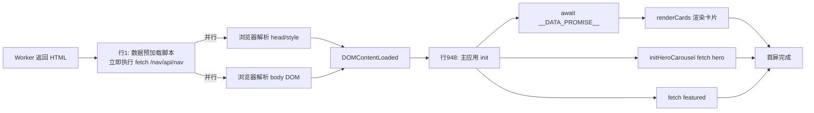

# 内联 JS 总览与加载策略


> ！核心特征
> 
> GalNavi **没有任何外部 JS 文件**（除 Cloudflare 自身的 challenge-platform）。所有业务 JavaScript 都以 `<script>` **内联**在每个页面的 HTML 中。这是一种"零外部请求"的极简部署策略。

## 为什么全内联？

| 原因 | 说明 |
|---|---|
| 零额外请求 | 一次 HTML 请求拿到全部代码，无需往返加载 JS/CSS |
| 部署简单 | Worker 直接拼 HTML 字符串返回，无需托管静态资源 |
| 边缘友好 | Cloudflare 边缘 SSR 时一并吐出，减少 RTT |
| 版本一致 | HTML 与 JS 同源同版本，无缓存错配 |

代价：HTML 体积大（主站 1.28MB），但**只有一次请求**，且可被边缘缓存。

## 各页面的脚本分布

### 入口页 `/`（637KB）
| 位置 | 脚本 | 作用 |
|---|---|---|
| 行942 | 业务脚本 | release-modal 发布页弹窗 |
| 行1066 | Cloudflare | challenge-platform（JS 检测，非业务）|

详见 [入口页发布页弹窗脚本](入口页发布页弹窗脚本.md)。

### 主站 `/nav/`（1.28MB）
| 位置 | 脚本 | 作用 |
|---|---|---|
| **行1** | **数据预加载脚本** | fetch D1 → `window.__DATA_PROMISE__` |
| 行948 | **主应用逻辑脚本**（23KB）| init / 渲染 / 搜索 / 轮播 / 跳转 |
| 行1604 | Cloudflare | challenge-platform |

> ⚠️ 关键设计：**数据预加载脚本放在 `<!DOCTYPE html>` 之前**（行1），使 fetch 在 HTML 解析同时进行，尽早开始网络请求。

详见 [数据预加载脚本（D1 载入）](数据预加载脚本（D1载入）.md)、[主应用逻辑脚本（卡片与交互）](主应用逻辑脚本（卡片与交互）.md)。

### 帮助页 `/nav/help/`（622KB）
| 位置 | 脚本 | 作用 |
|---|---|---|
| 行175 | 业务脚本 | 侧栏开合 + IntersectionObserver 滚动高亮 + 锚点复制 toast |

详见 [帮助页侧栏与锚点脚本](帮助页侧栏与锚点脚本.md)。

### 关于页 `/nav/about/`（5KB）
| 位置 | 脚本 | 作用 |
|---|---|---|
| 末尾 | 业务脚本 | 30 个粒子动画生成 |
| 末尾 | Cloudflare | challenge-platform |

当前是"系统维护中"页，粒子是纯装饰。

## CSP 对脚本加载的约束

主站 `/nav/` 的 Content-Security-Policy（详见 [内容安全策略 CSP](内容安全策略CSP.md)）：

```
script-src 'self' 'unsafe-inline' 
            https://lf26-cdn-tos.bytecdntp.com 
            https://static.cloudflareinsights.com;
```

解读：
- `'self'` — 允许同源脚本（但实际没用外部脚本文件）
- `'unsafe-inline'` — **必须**，因为所有 JS 都内联
- `https://lf26-cdn-tos.bytecdntp.com` — 字节跳动 CDN（预留，当前未实际加载脚本）
- `https://static.cloudflareinsights.com` — Cloudflare Web Analytics

> 注意：CSP 允许的这些外部源，**当前业务代码并未实际引用**，属于预留白名单或历史遗留。Cloudflare 的 challenge-platform 脚本由 CF 注入，受其自身机制保护。

## 加载顺序与时序



## 主站主应用 JS 的函数清单

行948 脚本（23KB）定义的核心函数（详见 [主应用逻辑脚本（卡片与交互）](主应用逻辑脚本（卡片与交互）.md)）：

| 函数 | 职责 |
|---|---|
| `escapeHtml` / `escapeRegExp` | XSS 防护与正则转义 |
| `buildCard` | 构建单张卡片 HTML |
| `buildTagStats` | 构建标签统计 |
| `renderCards` / `renderHomePage` / `renderTagsPage` / `renderPageContent` | 各视图渲染 |
| `filterByKeyword` / `doHomeSearch` / `setupNavSearch` | 搜索过滤 |
| `getByCategory` / `updateAllCounts` / `getPageCount` | 分类与计数 |
| `init` / `navigateTo` / `showHomeDefault` | 初始化与路由 |
| `initHeroCarousel` / `goTo` / `next` / `prev` / `startAuto` / `resetAuto` | 轮播 |
| `startRedirect` / `tick` / `cancel` | 外链跳转 |
| `setupDrawer` / `closeDrawer` | 移动端抽屉菜单 |

## 本维度子笔记索引

1. [数据预加载脚本（D1 载入）](数据预加载脚本（D1载入）.md) — 行1
2. [主应用逻辑脚本（卡片与交互）](主应用逻辑脚本（卡片与交互）.md) — 行948（最大）
3. [轮播图脚本（Hero Carousel）](轮播图脚本（HeroCarousel）.md) — 主站
4. [外链跳转脚本（Redirect 倒计时）](外链跳转脚本(Redirect倒计时).md) — 主站
5. [入口页发布页弹窗脚本](入口页发布页弹窗脚本.md) — 入口页
6. [帮助页侧栏与锚点脚本](帮助页侧栏与锚点脚本.md) — 帮助页
7. [XSS 防护与 escapeHtml](XSS防护与escapeHtml.md) — 通用

## 相关笔记

- 架构背景 → [整体技术架构](整体技术架构.md)
- 渲染流程 → [请求与渲染流程](请求与渲染流程.md)
- CSP 详解 → [内容安全策略 CSP](内容安全策略CSP.md)
- 上一级 → [00 知识库地图 (MOC)](00知识库地图(MOC).md)
