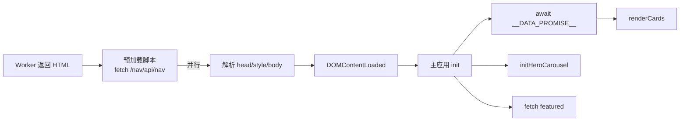

# 内联 JS 总览与加载策略

> [!info] 核心特征
>
> GalNavi **没有业务外部 JS 文件**（除 Cloudflare challenge-platform）。业务脚本均以内联 `<script>` 嵌入各页 HTML。经多次压缩/改版后，**不宜再依赖具体行号**定位代码。

## 为什么全内联？

| 原因 | 说明 |
|---|---|
| 零额外请求 | 一次 HTML 拿到全部代码 |
| 部署简单 | Worker 拼 HTML 字符串返回 |
| 版本一致 | HTML 与 JS 同响应，无缓存错配 |

代价：HTML 体积大（主站约 1～2MB 量级），但只有一次请求。

## 各页面的脚本分布

### 入口页 `/`
- 业务：发布页弹窗（open / close / 复制域名）
- 另可能有 Cloudflare challenge

详见 [[入口页发布页弹窗脚本]]。

### 主站 `/nav/`
| 阶段 | 作用 |
|---|---|
| **DOCTYPE 前预加载** | `escapeHtml` / `isSafeHttpUrl` + fetch `/nav/api/nav` → `__DATA_PROMISE__` |
| **主应用脚本** | init / 渲染 / 搜索 / 轮播 / 外链倒计时 |
| Cloudflare | challenge-platform（非业务）|

预加载放在 `<!DOCTYPE html>` 之前，使 fetch 与 HTML 解析并行。

详见 [[数据预加载脚本（D1载入）]]、[[主应用逻辑脚本（卡片与交互）]]。

### 帮助页 `/nav/help/`
浮动目录开合 + IntersectionObserver 高亮 + 锚点复制 toast。详见 [[帮助页侧栏与锚点脚本]]。

### 关于页 `/nav/about/`
无业务 JS；纯 SSR + JSON-LD。详见 [[关于页]]。

## CSP

主站需 `'unsafe-inline'`（全内联）。详见 [[内容安全策略CSP]]。

## 加载时序

## 主应用核心函数

| 函数 | 职责 |
|---|---|
| `escapeHtml` / `escapeRegExp` / `isSafeHttpUrl` | 转义与 URL 校验 |
| `buildCard` | 卡片 HTML（标签最多 5 个）|
| `renderCards` / `renderHomePage` / `renderTagsPage` | 各视图 |
| `filterByKeyword` / `setupNavSearch` | 搜索 |
| `navigateTo` / `init` | 路由与初始化 |
| `initHeroCarousel` 等 | 轮播 |
| `startRedirect` | 外链倒计时 |
| `setupDrawer` | 移动端抽屉 |

## 子笔记索引

1. [[数据预加载脚本（D1载入）]]
2. [[主应用逻辑脚本（卡片与交互）]]
3. [[轮播图脚本（HeroCarousel）]]
4. [[外链跳转脚本(Redirect倒计时)]]
5. [[入口页发布页弹窗脚本]]
6. [[帮助页侧栏与锚点脚本]]
7. [[XSS防护与escapeHtml]]

## 相关笔记

- [[整体技术架构]]
- [[请求与渲染流程]]
- [[内容安全策略CSP]]
- [[00知识库地图(MOC)]]
