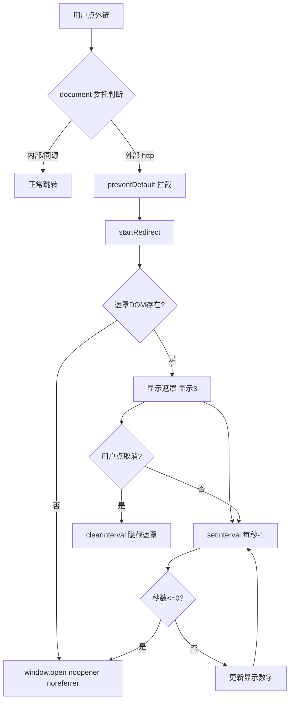

# 外链跳转脚本（Redirect 倒计时）

> [!info] 位置
> 主站 `/nav/` 行948 主应用脚本中的 `startRedirect(targetUrl)` 及配套的 `tick` / `cancel` 函数。这是 GalNavi **外链安全设计**的核心实现。

## 设计目的

GalNavi 收录大量第三方站点链接。直接跳转存在风险：
- 用户可能误点
- 跳转后 referer 泄露本站信息
- 恶意站点可能通过 `window.opener` 劫持原标签页

GalNavi 的方案：**拦截外部链接 → 弹出 3 秒倒计时确认层 → 用户可取消 → 到时用安全方式打开**。

## 触发机制（全局事件委托）

`startRedirect` 不直接绑定到按钮，而是通过 `document` 级的点击委托触发（见 [主应用逻辑脚本（卡片与交互）](主应用逻辑脚本（卡片与交互）.md)）：

```javascript
document.addEventListener('click', function(e) {
    var anchor = e.target.closest('a');
    if (!anchor) return;
    var href = anchor.getAttribute('href');
    if (!href) return;
    // 排除：内部路由 /nav/*
    if (href.startsWith('https://galnavi.top/nav/') || href.startsWith('/nav/')) return;
    // 排除：锚点、js 协议
    if (href.startsWith('#') || href.startsWith('javascript:')) return;
    // 只拦截 http(s) 开头
    if (!href.startsWith('http')) return;
    // 排除：同源
    try { if (new URL(href).hostname === window.location.hostname) return; } catch (_) { return; }
    // 命中外链 → 拦截默认行为，走倒计时
    e.preventDefault();
    e.stopPropagation();
    startRedirect(href);
});
```

**拦截范围**：所有 `http(s)://` 开头且**非同源**、**非 `/nav/` 内部路由**的链接。
**不拦截**：内部页面跳转、锚点、同源链接。

> 注意：[详情页 `/nav/detail/`](../05-页面详解/详情与外链跳转.md) 是独立 SSR 页面，**没有**这个拦截器，所以详情页的外链（网盘等）是直接 `target="_blank"` 跳转的。

## 完整源码

```javascript
function startRedirect(targetUrl) {
    var overlay = document.getElementById('redirectOverlay');
    var countdownEl = document.getElementById('redirectCountdown');
    var cancelBtn = document.getElementById('redirectCancel');
    // 若 DOM 元素缺失 → 直接安全打开
    if (!overlay || !countdownEl) {
        window.open(targetUrl, '_blank', 'noopener,noreferrer');
        return;
    }
    var seconds = 3;
    var timerId;
    overlay.classList.add('active');
    countdownEl.textContent = seconds;

    function tick() {
        seconds--;
        if (seconds <= 0) {
            clearInterval(timerId);
            window.open(targetUrl, '_blank', 'noopener,noreferrer');
            overlay.classList.remove('active');
            return;
        }
        countdownEl.textContent = seconds;
    }

    timerId = setInterval(tick, 1000);

    function cancel() {
        clearInterval(timerId);
        overlay.classList.remove('active');
        cancelBtn.removeEventListener('click', cancel);
    }

    cancelBtn.addEventListener('click', cancel);
}
```

## 逐段解析

### 1. DOM 依赖检查 + 降级
```javascript
if (!overlay || !countdownEl) {
    window.open(targetUrl, '_blank', 'noopener,noreferrer');
    return;
}
```
- 若跳转层 DOM 不存在（SSR 失败或被删），不阻塞用户，直接安全打开
- 体现了"功能可降级，但始终安全"的原则

### 2. 显示倒计时层
```javascript
var seconds = 3;
overlay.classList.add('active');          // 显示遮罩
countdownEl.textContent = seconds;        // 初始显示 3
```
- `redirectOverlay` 是一个全屏半透明遮罩（SSR 在 HTML 中）
- `redirectCountdown` 是显示数字的元素

### 3. 倒计时 tick
```javascript
function tick() {
    seconds--;
    if (seconds <= 0) {
        clearInterval(timerId);
        window.open(targetUrl, '_blank', 'noopener,noreferrer');
        overlay.classList.remove('active');
        return;
    }
    countdownEl.textContent = seconds;
}
timerId = setInterval(tick, 1000);
```
- 每秒减 1
- 到 0 时：清除定时器 → 用 `window.open` 安全打开 → 隐藏遮罩
- **`window.open(url, '_blank', 'noopener,noreferrer')`** 是关键安全参数：
  - `noopener`：新窗口的 `window.opener` 为 null，防止反向劫持原标签
  - `noreferrer`：不发送 referer，保护用户隐私与本站信息

### 4. 取消机制
```javascript
function cancel() {
    clearInterval(timerId);
    overlay.classList.remove('active');
    cancelBtn.removeEventListener('click', cancel);  // 清理监听
}
cancelBtn.addEventListener('click', cancel);
```
- 用户点"取消"按钮 → 停止倒计时、隐藏遮罩
- `removeEventListener` 清理监听器，避免重复绑定泄露

## 交互流程



## 安全收益

| 风险 | 本方案防护 |
|---|---|
| 误点外链 | 3 秒缓冲可取消 |
| referer 泄露 | `noreferrer` |
| tab 劫持（opener attack）| `noopener` |
| 不安全跳转 | 给用户思考时间 |

## 与详情页的区别

| 场景 | 跳转方式 |
|---|---|
| 主站卡片"链接直达" | 被全局拦截器捕获 → **倒计时确认** |
| 主站卡片"介绍详情" | 指向 `/nav/detail/?item_key=`，**内部路由不拦截** |
| 详情页内的外链（官网/网盘）| 详情页无拦截器 → **直接 target=_blank 跳转** |

> 这是个不一致点：详情页外链没有倒计时保护。可能是认为详情页用户已主动进入、意图明确，故省略。

## 相关笔记

- 调用方 → [主应用逻辑脚本（卡片与交互）](主应用逻辑脚本（卡片与交互）.md)（全局事件委托）
- 详情页 → [详情与外链跳转](../05-页面详解/详情与外链跳转.md)
- 安全设计总览 → [外链安全设计](../06-安全与SEO/外链安全设计.md)
- 总览 → [内联 JS 总览与加载策略](内联 JS 总览与加载策略.md)
- 上一级 → [00 知识库地图 (MOC)](../00 知识库地图 (MOC).md)
