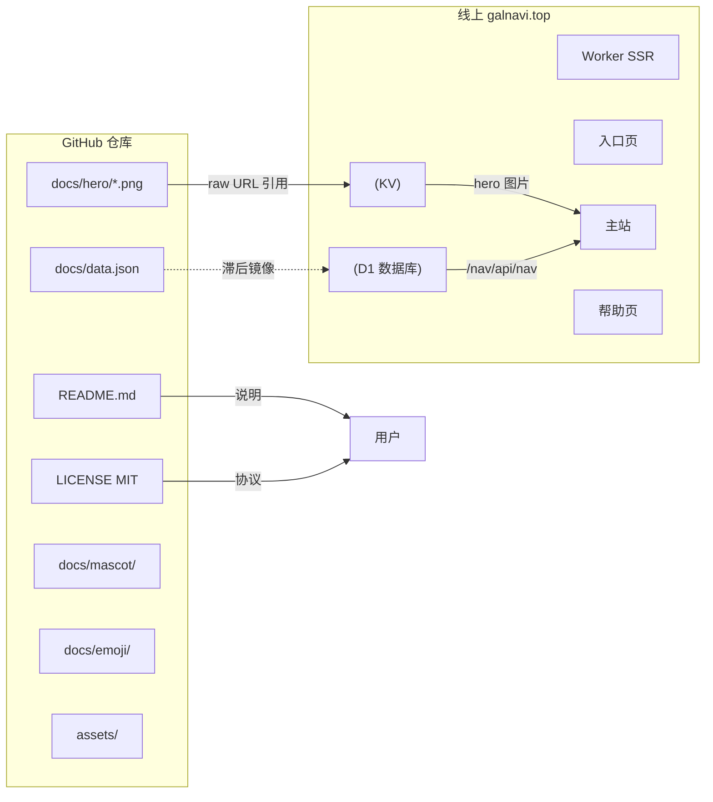

# GitHub 仓库的角色

> ！关键认知
> 
> 仓库 `argb6/gal-navigation` **不存放网站源代码**，只存放**数据与素材资源**。这是一个容易被误解的点——它不是常规的"代码仓库"，而是 GalNavi 的"数据仓库 + 静态资源 CDN + 项目说明"。

## 仓库地址

[argb6/gal-navigation](https://github.com/argb6/gal-navigation)

## 仓库实际内容（git ls-files 核实）

### 非图片文件（仅 3 个）
| 文件 | 作用 |
|---|---|
| `README.md` | 项目说明（含截图、框架图、联系方式）|
| `LICENSE` | MIT 协议 |
| `docs/data.json` | 站点数据 |

### 图片资源
- `assets/` — icon / logo / favicon / old
- `docs/hero/` — 轮播图（被线上 KV 引用）
- `docs/mascot/` — 吉祥物
- `docs/emoji/` — 表情包
- `docs/*.png` — 入口/主站/详情截图（README 用）

### 没有的东西（重要）
- ❌ 没有 `package.json`、`wrangler.toml`
- ❌ 没有 `.js` / `.ts` / `.html` / `.css` 源文件
- ❌ 没有 Worker 代码、没有构建配置
- ❌ 没有测试文件

> 仓库无任何代码文件，**网站源代码不公开**，仅部署在 Cloudflare 上。

## 仓库的三大角色

### 角色 1：数据滞后镜像
- `docs/data.json` 是线上 D1（`/nav/api/nav`）的**滞后镜像**，字段结构一致但条目数可能不同步
- 推测工作流：站长改 D1 → 定期导出 data.json 提交仓库，存在滞后窗口
- 仓库让数据**可追溯、可 diff、可社区贡献**，但**非实时权威源**

### 角色 2：静态资源 CDN
- `docs/hero/hero*.png` 被线上 KV 引用（[轮播图脚本（Hero Carousel）](../03-部署的JS/轮播图脚本（HeroCarousel）.md)）
- 通过 `raw.githubusercontent.com` 访问，免费 CDN
- 详见 [图片素材资源](图片素材资源.md)

### 角色 3：项目门面与社区入口
- `README.md` 是项目的公开说明书
- Issues 是提交新站点/反馈的渠道（[开源与社区](../01-项目总览/开源与社区.md)）
- README 的 badges（license、discord、stars、issues）展示项目状态

## 仓库与线上的对应关系

## 对知识库的影响

公开 GitHub 仓库**不含** Worker / 前端业务源码，主要是数据与素材。站点业务以 **Worker 内联 HTML/JS** 形式部署；本知识库对「部署的 JS」的分析依据线上渲染产物（及可对照的部署脚本），而非该公开仓库。这也解释了为何脚本是内联——便于在边缘以字符串拼接生成页面。

## 相关笔记

- 数据 → [data.json 数据结构](data.json数据结构.md)
- 素材 → [图片素材资源](图片素材资源.md)
- 架构 → [整体技术架构](../02-网站架构/整体技术架构.md)
- 开源 → [开源与社区](../01-项目总览/开源与社区.md)
- 上一级 → [00 知识库地图 (MOC)](../00知识库地图(MOC).md)
