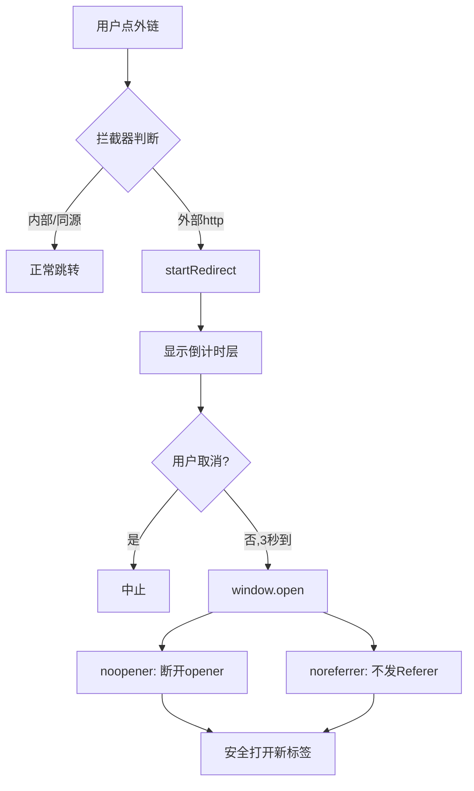

# 外链安全设计

> [!info] 概述
> GalNavi 作为导航站，核心动作是引导用户跳转到外部站点。外链安全是重中之重。**主站与详情页均采用倒计时确认 + noopener + noreferrer** 的多重防护（源码确认）。

## 外链安全风险

导航站跳转外链时面临三类风险：

### 风险 1：反向 Tab 劫持（Reverse Tabnabbing）
- 用 `window.open` 或 `target="_blank"` 打开新标签时，新标签的 `window.opener` 指向原标签
- 恶意站点可用 `window.opener.location = '...'` 把原 GalNavi 标签重定向到钓鱼页

### 风险 2：Referer 泄露
- 跳转时浏览器发送 Referer 头，暴露 GalNavi 是来源

### 风险 3：误点与不安全跳转
- 用户可能误点外链，跳转前无确认

## GalNavi 的多层防护

### 第 1 层：noopener（防 Tab 劫持）

主站倒计时跳转（`websearch.js`）：
```javascript
window.open(targetUrl, '_blank', 'noopener,noreferrer');
```

详情页外链（`detail.js`）：
```html
<a class="link-entry" href="..." target="_blank" rel="noopener noreferrer" data-url="...">
```
跳转时同样：
```javascript
window.open(targetUrl, '_blank', 'noopener,noreferrer');
```

`noopener` 使新窗口的 `window.opener = null`，断开反向引用，彻底防 Tab 劫持。

### 第 2 层：noreferrer（防 Referer 泄露）
- `noreferrer` 使跳转不发送 Referer 头
- 目标站无法得知用户来自 GalNavi
- 保护用户隐私

### 第 3 层：3 秒倒计时确认（防误点）
主站和详情页都把外链点击改为：
```
点外链 → preventDefault → 显示倒计时层(3秒) → 用户可取消 → 到时打开
```
- 给用户思考与取消的时间
- 详见 [[03-部署的JS/外链跳转脚本（Redirect 倒计时）]]

### 第 4 层：CSP connect-src（防数据外泄）
```
connect-src 'self' https://galnavi.top;
```
- 客户端 JS 的 fetch/XHR 只能访问同源
- 即使有 XSS 注入，也无法把数据发到外部服务器
- 详见 [[内容安全策略 CSP]]

## 主站 vs 详情页的跳转实现

主站和详情页**安全效果一致**（都有倒计时 + noopener + noreferrer），但**绑定方式不同**：

| 维度 | 主站卡片"链接直达" | 详情页外链 |
|---|---|---|
| 跳转方式 | 3 秒倒计时确认 | 3 秒倒计时确认 |
| 绑定方式 | `document` 全局事件委托 | 逐个 `addEventListener` |
| noopener | ✅（window.open 时）| ✅（window.open 时）|
| noreferrer | ✅ | ✅ |
| 取消按钮 | ✅ `redirectCancel` | ✅ `redirectCancel` |
| DOM 层 | `redirectOverlay` | `redirect-overlay` |
| Worker | `websearch.js` | `detail.js` |

### 主站实现（document 委托）
```javascript
// websearch.js：全局拦截外部链接
document.addEventListener('click', function(e) {
    var anchor = e.target.closest('a');
    // ...排除内部路由/锚点/同源
    e.preventDefault();
    e.stopPropagation();
    startRedirect(href);   // → 3 秒倒计时
});
```
用事件委托，动态渲染的卡片也生效。详见 [[03-部署的JS/主应用逻辑脚本（卡片与交互）]]。

### 详情页实现（逐个绑定）
```javascript
// detail.js：DOMContentLoaded 后对每个 .link-entry 绑定
document.querySelectorAll('.link-entry[href]').forEach(function(link) {
    link.addEventListener('click', function(e) {
        e.preventDefault();
        // → 3 秒倒计时（与主站逻辑相同）
    });
});
```
详情页外链在 SSR 时已生成，故逐个绑定即可。详见 [[05-页面详解/详情与外链跳转]]。

## 拦截器的精准排除（主站）

主站拦截器**只拦截外部链接**，精确排除：
- `/nav/*` 内部路由（不拦截，正常跳转）
- `#` 锚点、`javascript:` 协议（不拦截）
- 非 http 开头（不拦截）
- 同源链接（不拦截）

这保证了内部导航流畅，只对外链设防。

## 安全设计总结



## 与同类站点对比

许多导航站直接 `<a href="..." target="_blank">` 跳转，缺失：
- ❌ 无 noopener（有 Tab 劫持风险）
- ❌ 无确认（易误点）
- ❌ 无 Referer 保护

GalNavi 的外链安全设计在同类中属于**较严谨**的水平，且主站与详情页已统一。

## 相关笔记

- 主站跳转实现 → [[03-部署的JS/外链跳转脚本（Redirect 倒计时）]]
- 主站拦截器 → [[03-部署的JS/主应用逻辑脚本（卡片与交互）]]
- 详情页 → [[05-页面详解/详情与外链跳转]]
- CSP → [[内容安全策略 CSP]]
- 安全响应头 → [[安全响应头]]
- 上一级 → [[00 知识库地图 (MOC)]]
