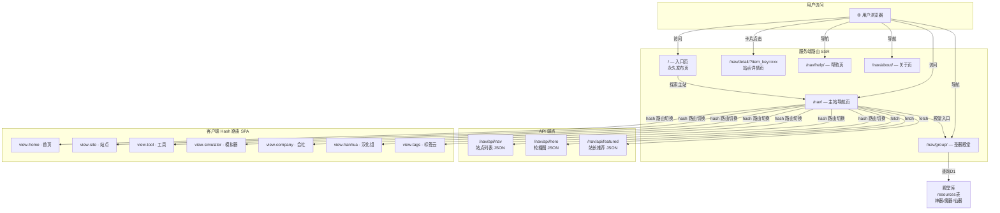
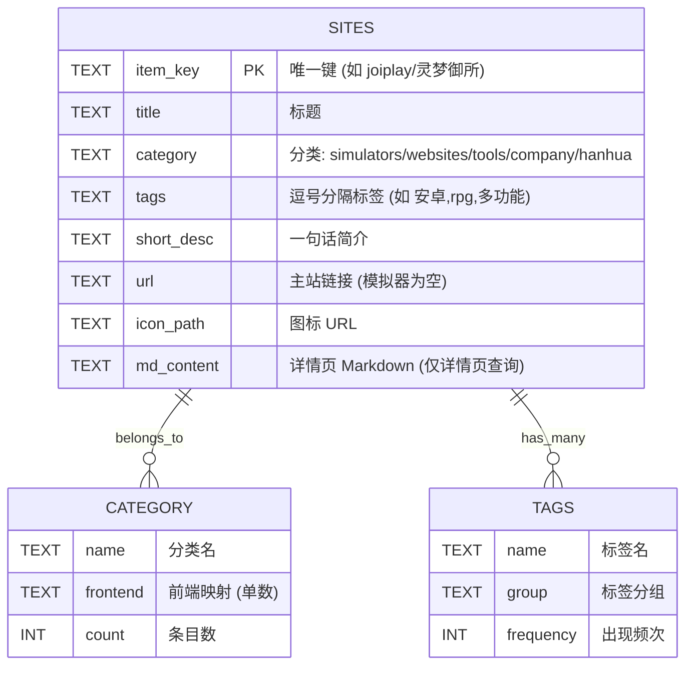
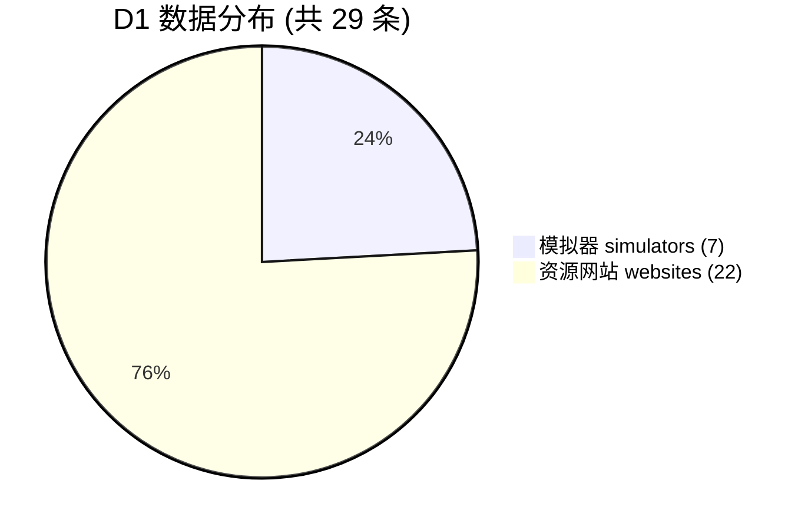
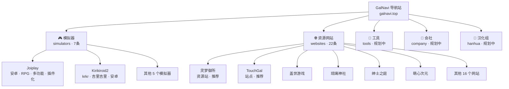
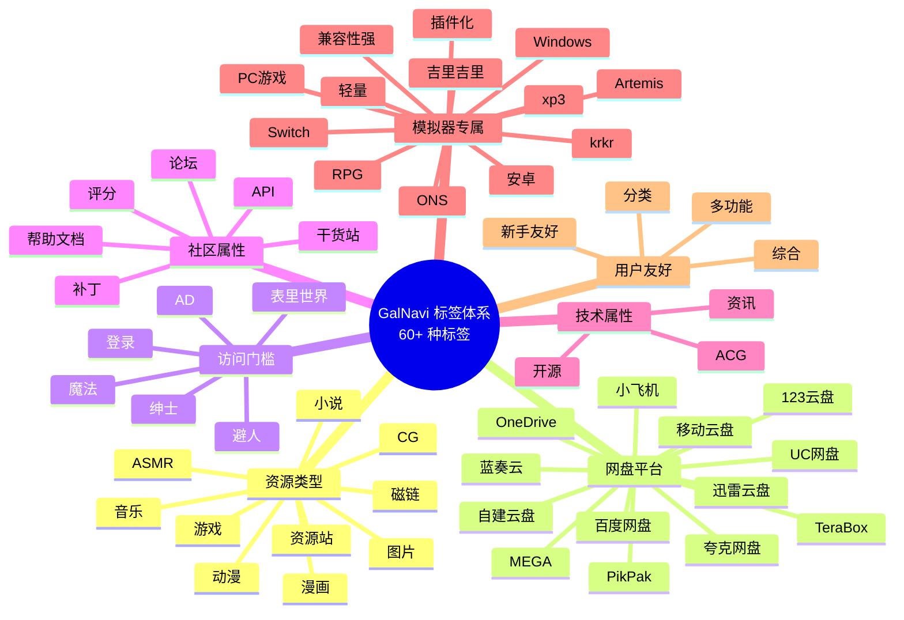
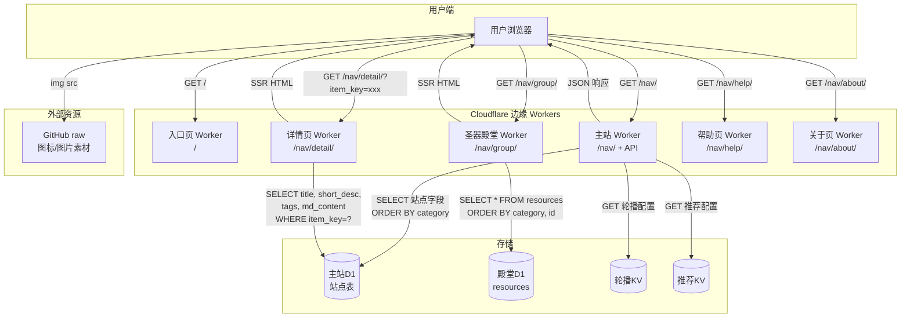
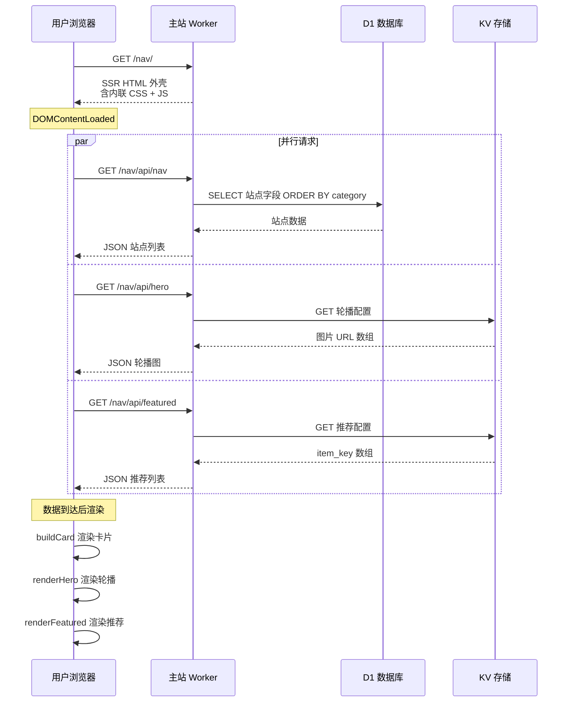
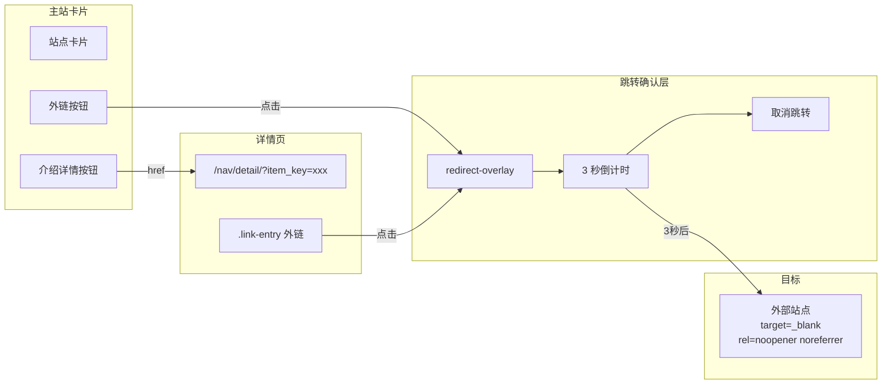
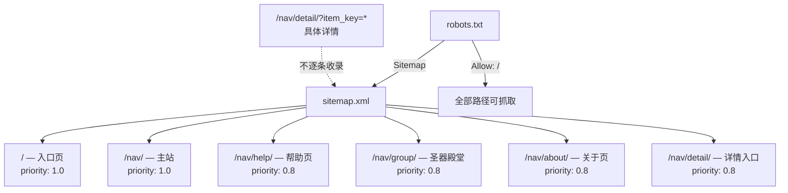
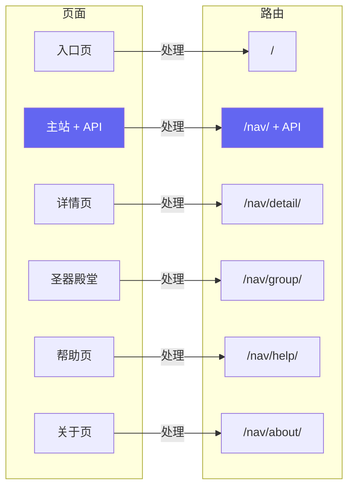

# 🌐 GalNavi 网站框架总览

> [!tip] 一图看懂全站
> 本文用 **Mermaid** 图表展示路由、存储与数据流。
> **笔记导航**请走：[[00知识库地图(MOC)]] → 各节索引（[[项目总览]] / [[网站架构]] / …），避免从总图直接散点跳叶子笔记。

---

## 一、站点总入口与页面路由



---

## 二、D1 数据库 — 站点核心数据



### D1 五大分类与数据分布

| D1 category  | 前端映射        | 条目数 | 状态     |
| ------------ | ----------- | --- | ------ |
| `simulators` | `simulator` | 7   | ✅ 已有数据 |
| `websites`   | `site`      | 22  | ✅ 已有数据 |
| `tools`      | `tool`      | 0   | 📋 规划中 |
| `company`    | `company`   | 0   | 📋 规划中 |
| `hanhua`     | `hanhua`    | 0   | 📋 规划中 |



---

## 三、KV 存储 — 配置型数据

```mermaid
graph LR
    subgraph KV Namespace 1 · 轮播图
        HERO_KEY["key: 轮播配置"]
        HERO_VAL["value: JSON 数组<br/>[图片URL1, URL2, URL3]"]
    end

    subgraph KV Namespace 2 · 站长推荐
        FEAT_KEY["key: 推荐配置"]
        FEAT_VAL["value: JSON 数组<br/>[灵梦御所, touchgal, ...]"]
    end

    subgraph 容错机制
        PARSE["JSON.parse"]
        SPLIT["逗号分割"]
        SINGLE["单元素数组"]
        FALLBACK["标签匹配算法<br/>取含'推荐'标签条目"]
    end

    HERO_VAL --> PARSE
    PARSE -->|失败| SPLIT
    SPLIT -->|失败| SINGLE

    FEAT_VAL --> PARSE
    PARSE -->|为空| FALLBACK
    FALLBACK -->|POST 回写| FEAT_VAL
```

### D1 vs KV 分工

| 维度 | D1 | KV |
|---|---|---|
| 模型 | 关系型 SQLite | 键值对 |
| 查询 | SQL（过滤/排序）| 按 key 整取 |
| 一致性 | 强一致 | 最终一致（边缘缓存）|
| GalNavi 用途 | 29 条站点核心数据 | 轮播图 + 站长推荐 |
| 读取延迟 | 略高（需查询）| 极低（边缘缓存）|
| 变更频率 | 中（新增/编辑站点）| 极低（手动调整）|

---

## 四、站点分类体系



---

## 五、标签体系总览



---

## 六、完整数据流转图



---

## 七、请求与渲染时序



---

## 八、安全跳转流程



---

## 九、SEO 与收录结构



---

## 十、路由映射



> 主站承担导航渲染与全部 JSON API；圣器殿堂使用独立殿堂 D1。

---

## 相关笔记

- 上一级 → [[00知识库地图(MOC)]]
- 分节索引：[[项目总览]] · [[网站架构]] · [[部署的JS]] · [[数据与资源]] · [[页面详解]] · [[安全与SEO]]
